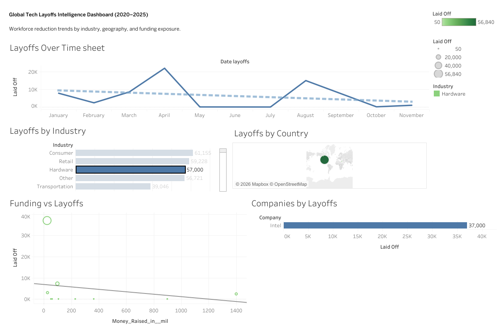

# 🌍 Global Tech Layoffs Intelligence Dashboard (2020–2025)

## 🚀 Project Overview
This Tableau dashboard analyzes global tech workforce reductions from 2020 to 2025, identifying industry vulnerability, geographic impact, and funding-stage exposure.

The objective was to uncover macro-level workforce contraction trends and evaluate whether funding levels influenced layoff intensity during economic downturn periods.

---

## 📊 Business Questions Explored
- Which industries experienced the highest workforce reductions?
- How did layoffs trend over time across economic cycles?
- Which countries were most impacted?
- Did higher funding levels protect companies from layoffs?
- Which companies had the largest workforce reductions?

---

## 📈 Key Visual Components
- Layoffs Trend Over Time (Time-Series Analysis)
- Industry-Level Impact Ranking
- Geographic Layoff Distribution (Map)
- Funding vs Layoffs Correlation (Scatter + Regression)
- Top 10 Companies by Workforce Reduction

---

## 🧠 Analytical Techniques Used
- Linear Regression Trend Analysis
- Correlation Evaluation (R² interpretation)
- Top-N Filtering
- Interactive Dashboard Filtering
- Geographic Mapping
- KPI Development

---

## 📌 Key Insight
A weak correlation (low R²) between funding raised and layoffs suggests that capital availability did not strongly shield companies from workforce reductions during downturn periods.

---

## 🛠 Tools & Skills Demonstrated
- Tableau Public
- Data Storytelling
- Business Intelligence Design
- Time-Series Analysis
- Scatter Plot Correlation
- Interactive Dashboard Design

---

## 🔗 Live Interactive Dashboard
👉 [View on Tableau Public](https://public.tableau.com/shared/KX2FCXC8R?:display_count=n&:origin=viz_share_link)

---

## 📷 Dashboard Preview

